Mobile Sinu

Ivan Alexandru January 5, 2022

Department of Computer Science Technical University of Cluj-Napoca

Structure of Computer Science

Laboratory project

Mobile Sinu

Name: Ivan Alexandru-Ionut

Group: 30432

Teaching assistant: Neagu Madalin

Contents

[1 Introduction](#_page3_x56.69_y56.69) 

1. [Context ](#_page3_x56.69_y238.01)
1. [Specifications ](#_page3_x56.69_y436.57)
1. [Objective ](#_page3_x56.69_y618.35)

[2 Bibliographic study](#_page4_x56.69_y56.69) 

1. [Flutter ](#_page4_x56.69_y242.83)
1. [Firebase ](#_page4_x56.69_y552.14)

[3 Analysis](#_page5_x56.69_y56.69) 

1. [Login/Register ](#_page5_x56.69_y242.83)
1. [Navigation Pages ](#_page6_x56.69_y56.69)

[4 Design](#_page7_x56.69_y56.69)

[4.1 Packages ](#_page7_x56.69_y242.83)

[5 Implementation](#_page9_x56.69_y56.69)

1. [Register ](#_page9_x56.69_y242.83)
1. [Notes ](#_page10_x56.69_y101.11)
1. [Navigation State ](#_page11_x56.69_y56.69)

[6 Testing and validation](#_page12_x56.69_y56.69)

[7 Conclusions and Bibliography](#_page17_x56.69_y56.69)

1. [Conclusions ](#_page17_x56.69_y242.83)
1. [Bibliography ](#_page17_x56.69_y516.21)

**Introduction**

1. Context

The aim of this project was to develop a standalone application that can make it easier for students to interact with their academic life by being able to register as a user and store their most important information, as well as giving them the opportunity to see their schedule in real-time from the mobile app.

The app can be used by anyone who possesses a mobile phone which runs on an Android or iOS operating system and has a valid internet connection, as the application makes recur- rent calls to an online databases which will be presented below. It was developed as a solution for the well-known Web Sinu app, which sometimes, especially when there are too many requests to the site, it crashes or lags a lot.

2. Specifications

The app was developed in the Flutter programming language and tested on an Android Studio emulator with Android version 9.0, but it can also run on iOS devices. Besides the general packages that flutter needs to use, it also makes use of some predefined packages in order to make the development and future change easier, like syncfusion flutter calendar or flutter datetime picker, which will be detailed below.

Moreover, I wanted the app to be standalone and to be usable by anyone, anywhere and for this reason I have made use of an online database provider, called Firebase, made by Google, which is free up to 500k requests per day.

3. Objective

The objective was simple - to develop an application which is easy to use and easy to inter- act with, while making use of the learned objectives from the course and as well throughout the years of study beforehand. The application can also be packed and deployed and, if necessary, uploaded on Google Store for anyone to be able to download it.

**Bibliographic study**

1. Flutter

Flutter is a relatively new programming language developed by Google and based on an- other programming language - Dart, a language optimized for fast apps on any platform. It is used to develop cross platform applications for Android, iOS, Linux, Mac, Windows, Google Fuchsia,Web platform, and the web from a single codebase.

It basically has three main characteristics: Fast - its code compiles to ARM or Intel machine code as well as JavaScript, for fast performance on any device, Productive - build and iterate quickly with Hot Reload. Update code and see changes almost instantly, without losing state and Flexible - control every pixel to create customized, adaptive designs that look and feel great on any screen.

Flutter relies mostly on its Widgets - they are generally defined in three basic types: Stateful widgets, Stateless widgets, and Inherited widgets. Being the central class hierarchy in the Flutter framework the three basic types of widgets are used in the construction of every Flutter application. Although all the instances of a widget are immutable, the Stateful widget allows the interaction between user and application. By giving access to the method setState, the state can be maintained in separate state objects. Alternatively, the Stateless widget acts

as a constant, and before anything displayed can be changed, the widget has to be recreated.

2. Firebase

Firebase is a platform developed by Google for creating mobile and web applications. It makes the creation and deployment of apps much more easier by providing, among others, online, real-time database support for free or paid.

In order to connect the Flutter app with the Realtime database, there were added some configuration files, as well as some certificates in the classpath of the application so that the connection will be successful. Recurring calls were then made in order for the application to retrieve or save data on the database for specific queries.

**Analysis**

1. Login/Register

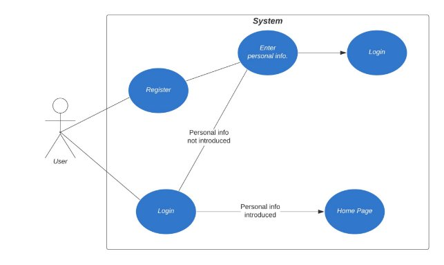

As we can see from the use-case diagram from above, the User is firstly granted with a Login Page where he can either Login or Register. When the user first registers, he needs to input his/hers personal information to be stored in the database in order to be granted with the Home Page. If he does it, he will be redirected to the Login Page to login for the first time. If he chooses not to enter the information for now, the next time he will try to login, he will be prompted with the page where he needs to enter the personal information and then the flow resumes as above.

2. Navigation Pages

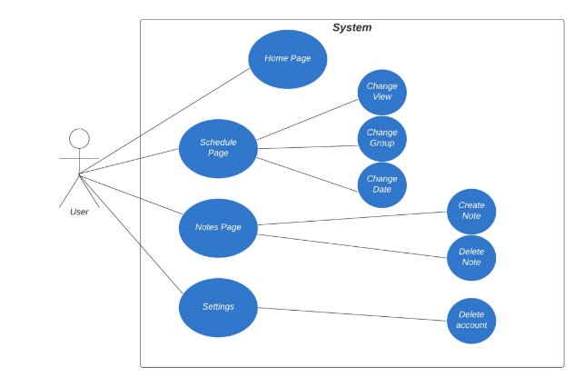

In the Navigation Pages, the user can navigate through all the four pages that the app provides: Home Page, Calendar Page, Notes Page and Settings Page with the help of the navigation bar from the bottom of the screen. If the application window is switched with another, the page that the user was on when the switch was made is remembered and the next time he’ll open the window, that page will be prompted.

While in the Login/Register pages, the user had to introduce his/hers information, while he is in the Home Page, all those information will be displayed.

In the Calendar Page, the user can Change the view of the calendar - Daily, Weekly and Monthly, Change the group for which the calendar is displayed or Change the date which is displayed in the calendar, by switching from day to day, week to week or month to month.

The Notes Page makes it easy for the user to store messages or tasks which he can view later as they are stored in the database. Creating a note or Deleting a note are the action the user can perform while navigating this page.

The user can also delete the account permanently in the Settings Page by providing his/hers password.

**Design**

4.1 Packages

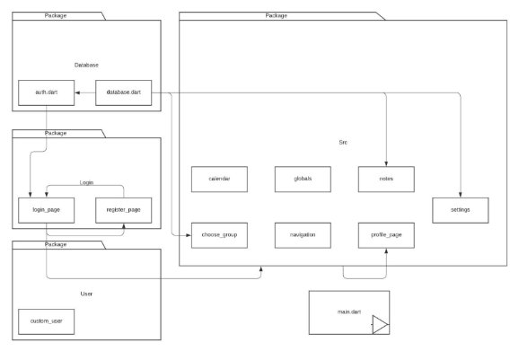

The packages were designed to suit the overall dependencies and to have a much more organized set of files. As we can above there are Database package, which comprises all the operations done to/from the database, the Login package, which keeps the logic from the Login/Register pages, while the User package keeps a model of an extended User class - Custom User. The rest of the implementation was kept in the Src package, as this is the main package.

There is also a main.dart file outside all the packages that simply has the main function which starts the application.

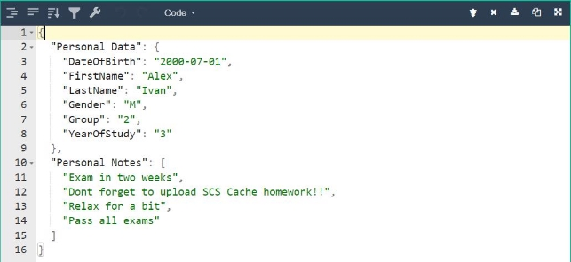

Above we can see the format of the data that is send towards the database. The Json is formed of two main parts: Personal Data and Personal Notes.

The first one is comprised of the personal information that the user has to input when Registering or Logging in - (dob, first and last names, the gender, the group and the year of study) in order to be fully identified in the systems the university can use.

The Personal Notes is a simple array of Strings, which represents the notes a user can create or delete while being in the Notes Page presented above.

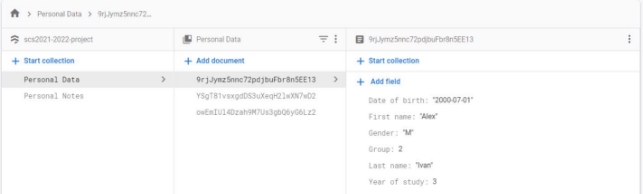

In the last image we can also see how the data is being encrypted with a UID - Unique Identifier that the user is given when he/she first registers. In this way, a level of security is being placed in the application so that no breaches are reached.

**Implementation**

1. Register

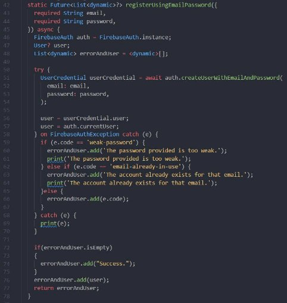

Explaining the implementation using Flutter and Dart would take a lot more pages, but

I will try to briefly explain the idea behind some functions. For example, above we have the registerUsingEmailPassword function that takes two arguments - a String - email and another String - password. It returns a Future of List of dynamics which basically means that the return is variable - it could or it could not exists (something known only in future) and for this reason the first function in the try...catch block is called using await keyword, which simply makes our function wait for the return of the function instead of going forward. The rest

of the code is simple, if an exception is thrown, it will be caught and if not, the UserCredential will be returned.

2. Notes

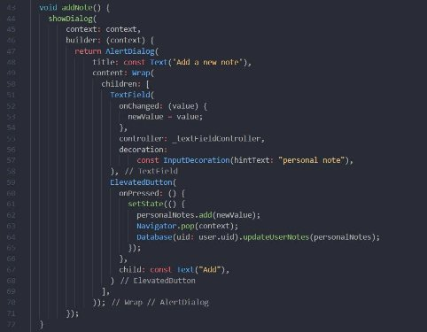

The image from above shows exactly how Flutter and Dart code works - all the Widgets are represented in a tree scheme, with some of them being parents, while others are the chil- dren. The function adds a note to the Personal Notes of the user by popping out an Alert Dialog, which has some characteristics - a title and a content. The content is represented by a Wrap, which is a special Widget that can store a list of Widgets (so it is basically and array with different properties). The Wrap contains a TextField and an ElevatedButton, which will be showed in an image below. When the user presses the button, the note is sent to the Database to be stored.

3. Navigation State

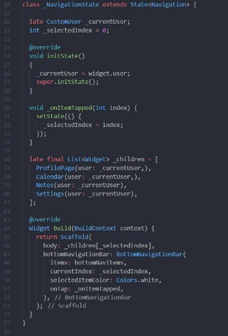

For the Stateful Widgets from Flutter there can be defined different States of that Wid- get, which can be changed between one another or their own state can be change. Above we can see an example of the Navigation Widget that helps us navigate between the pages. The state is basically a class that inherits two very important functions - initState and build, where the first one just calls the constructor of its parent class and the latter constructs the actual state of the Widget, with all its characteristics. There is also an onItemTap function that does the job of changing the page we’re at and a list of Widgets that holds all the pages we can go through.

This state simply hold one thing - a Scaffold that shows the page we are at and a Bot- tomNavigationBar which is the bar from below - the rest is magic.

**Testing and validation**

For this part we will try to register an account and also send some notes to the database. I will show the testing with images.

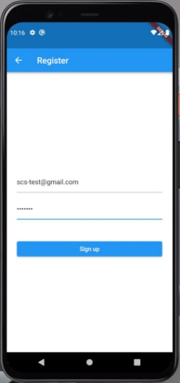

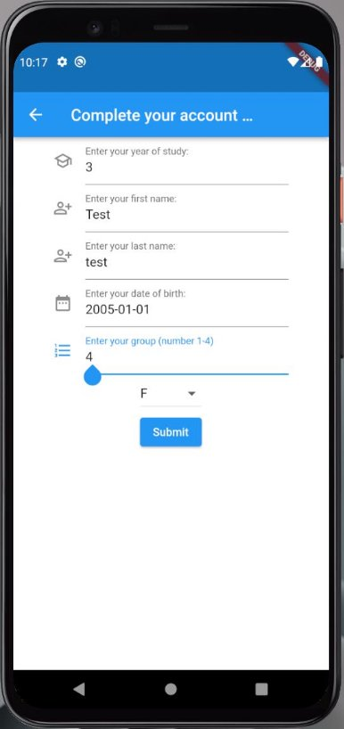

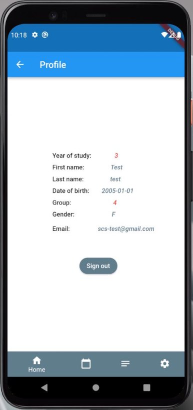

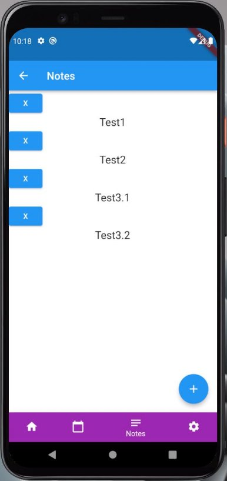

We can see that the data was sent to the database and stored with success.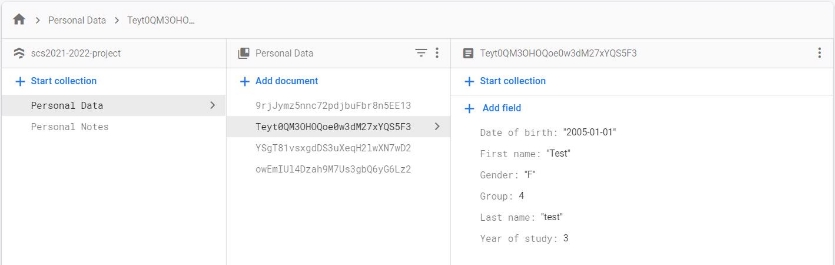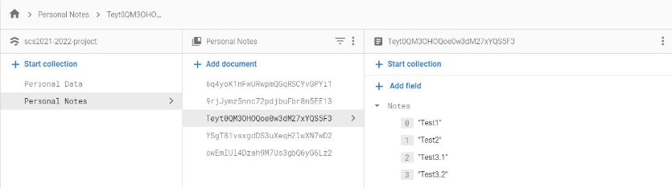

**Conclusions and Bibliography**

1. Conclusions

The conclusions are that a mobile app using this language is not that hard to develop and great things could be done with the new technologies that are out there on the market. I really enjoyed developing this project as I didn’t have to deal with VDHL stuff and the hard- ware implementations that I’m not fond of, but rather I prefer developing software applications and learning new technologies. Working with both Flutter and Firebase gave broadened my perspective and actually gave me the feeling that I can really develop and deploy an own ap- plication that can stand on its own and be also profitable in some way or another or maybe help people for free.

I hope that in the future I can work on the application again and improve it or, who knows, find a professional path in developing mobile apps using these technologies are more.

2. Bibliography
- <https://firebase.google.com/docs/flutter/setup?platform=ios>
- <https://firebase.flutter.dev/docs/auth/usage/>
- <https://blog.logrocket.com/how-to-build-a-bottom-navigation-bar-in-flutter/>
- <https://api.flutter.dev/flutter/widgets/ListView-class.html>
- <https://pub.dev/packages/syncfusion_flutter_calendar>
- <https://pub.dev/packages/flutter_datetime_picker>
- <https://stackoverflow.com>
- 

